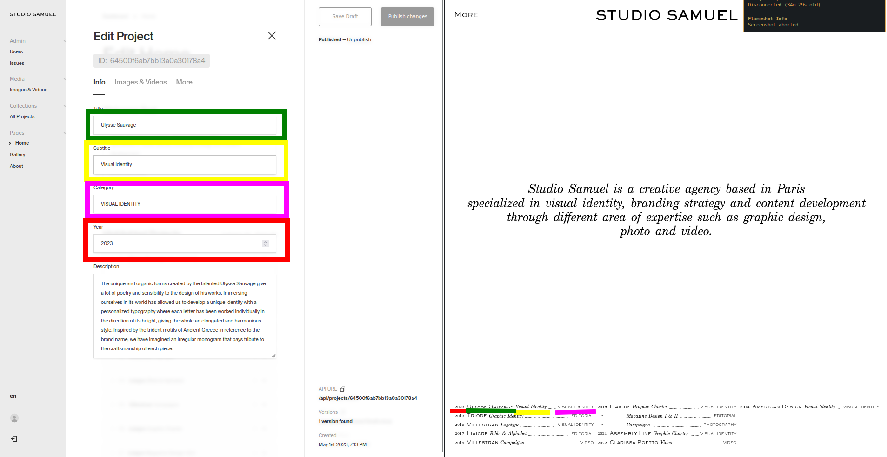

Hello Jeffrey 

# About InDesign

You mentionned InDesign which is in my opinion great for building websites mockups, but I find it terrible for generating websites.

Similar "no-code" tools like Wix, SquareSpace, Webflow, are good tools for building websites, but have some flaws

- Usually requires an overpriced monthly subscription
- Works best with premade templates
- Are quite limited if you don't follow their own design principles; in other words the design has to be adapted to to the tool and not the other way around.
- Are not exportable, e.g. you are locked in once you start using it
- Are quite bloated and slow

On the other hand, one advantage of these tools is that you can edit the layout of the website directly from within the back-office.
But this advantage is mostly due to the fact that everything is pretty much a template, or blocks of templates.

---
---

# "Headless" Back office (CMS)

I started with Wix but it was so infuriating and limiting to work with it that I to learned React (Javascript) instead, which allows me much more flexibility.

Since I build websites with code from scratch, this kind of feature is quite complex to implement, and overkill in my opinion for a portfolio.

So the alternative that I use is a "headless CMS (content management system)", a back office which only serves as a structured database for the content, which in essence works similary to Google Drive.
The front end of the website then automatically fetches the data from the back office to display it.
So all the pages from the front end are generated dynamically from the data in the back office.

---

Below are 2 CMS listed, Payload and Contentful

### Contentful

Contentful is a proprietary "working-out-of-the-box" (very little dev required) CMS which offers a free tier with good performance but a limited set of features

A potential issue is that like any other free software product, the company can decide to kill it whenever they want (although unlikely to happen soon),
in which case the only solution would be to rebuild a back office with something else as the paid plan starts at a whopping 500 euros / month
I just want to make it clear that if you choose the free plan, I cannot guarantee that it will work forever

---

### Payload

Payload on the other hand is an open source self hosted CMS, but isn't free to use, and requires some development
(Self hosted implies server fees of 20 euros/month, which includes the development of the back-office and its maintenance)

- Better UX
- It has a mobile mode, so you can update your website via your phone (a rare feature)
- It has image processing and optimization for faster loading times on mobile, which might be interesting considering the volume of photos you want to upload
- Full ownership, and will work forever as long as the server is running

---
---

## Payload CMS

Here is how it works; there are 2 main sections :

### The data pool (RED)
From which you can access all medias (images, pictures) and all projects

https://github.com/wSzki/jann/assets/59784520/ce326c25-d8cf-4bda-a2d2-26a56c055319

### Pages content (BLUE)
Where you define the content of the page, by using content from the data pool,
or adding the content directly if they aren't already stored in the pool

https://github.com/wSzki/jann/assets/59784520/c57802ee-601f-46ca-a8d0-03a5b798088a

Here are some other screenshot that may help you understand what's going on

You can visit the back office shown above via
https://cms.studiosamuel.fr

I'll send you the guest login and password via e-mail

---
---

## Contentful CMS

Basically the same thing but much less flexible

https://github.com/wSzki/jann/assets/59784520/c91f4126-6823-4dab-9637-f68c9fdee6f6

